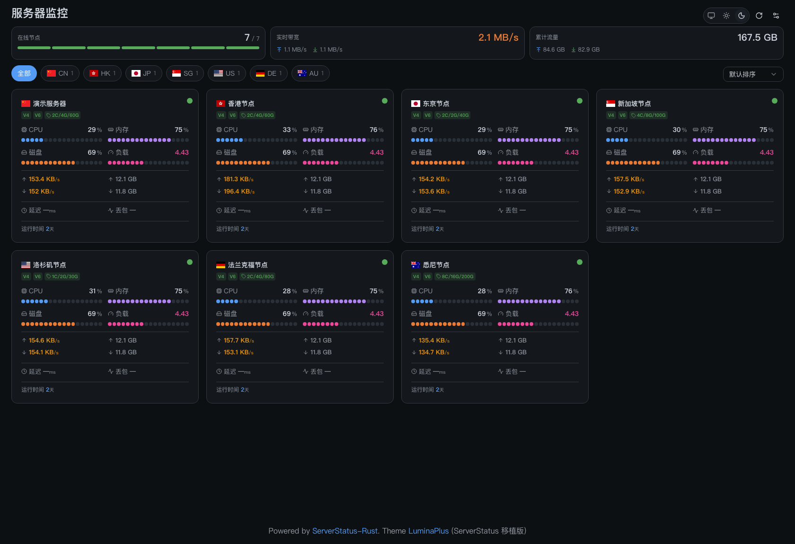
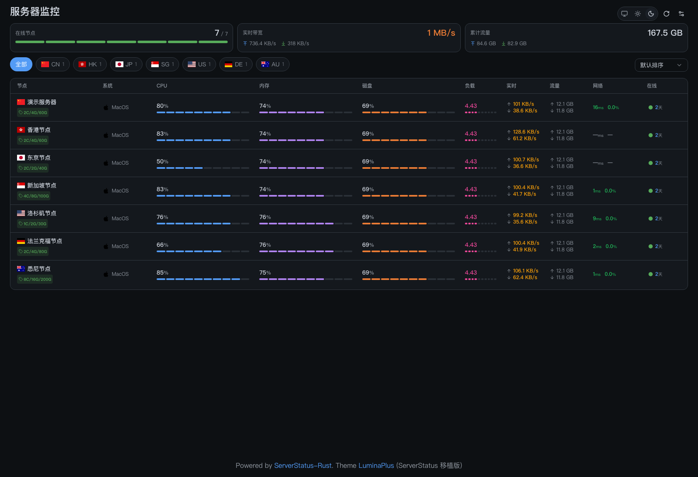
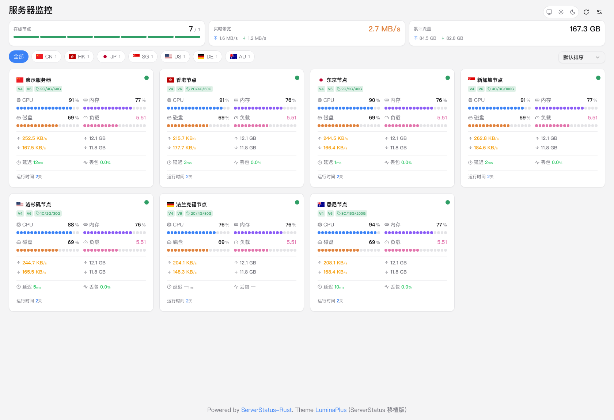
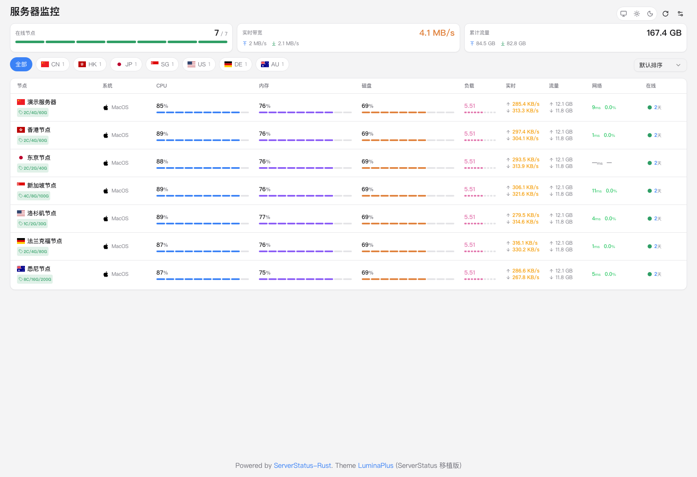

# ServerStatus Theme LuminaPlus

基于 [LuminaPlus](https://github.com/guboysky/LuminaPlus) 设计、使用 Vue 3 + shadcn/ui + Tailwind CSS 重构的 [ServerStatus-Rust](https://github.com/zdz/ServerStatus-Rust) 第三方主题。

界面设计移植自 LuminaPlus，移除了原版中 ServerStatus-Rust 不支持的功能，并做了大量性能与交互优化。

## 特性

- 🌓 **明暗主题**：深色 / 浅色 / 跟随系统三种模式，首屏防闪烁，深色深度可调
- 🧩 **shadcn/ui 组件体系**：组件源码全部在 `src/components/ui/` 下，完全可控、便于二次定制
- 📇 **两种视图**：迷你卡片 / 列表，按地区分组筛选、排序
- 📈 **CPU 记录折线图**：按需开启，懒初始化 + 降采样渲染，多节点同屏不卡顿
- 🌏 **三网延迟/丢包**：电信 / 联通 / 移动分运营商展示（数据来自客户端探测）
- 📱 **响应式**：窄屏自动折列 + 横向滚动，适配手机端
- ♿ **可访问性**：语义化标签、ARIA 属性、键盘可操作

## 界面预览

| | 🃏 卡片视图 | 📋 列表视图 |
| :---: | :---: | :---: |
| **🌙 深色** |  |  |
| **☀️ 浅色** |  |  |

## 使用说明

### 1. 构建主题

需要 Node.js 18+：

```bash
npm install
npm run build     # 类型检查 + 构建，产物在 dist/
```

开发调试：`npm run dev`（默认把 `/json` 代理到 `VITE_DEV_API` 指定的服务端，见 vite.config.ts）。

### 2. 部署到生产环境

ServerStatus-Rust 的服务端二进制会把主题在**编译时**嵌入（`web/` 目录打进二进制），所以部署方式取决于你现有服务的架构，三选一：

#### 方式 A：nginx 托管静态文件（推荐，无需重编译服务端）

适合已经在 nginx 后面跑 stat_server 的部署。把 `dist/` 上传到服务器（例如 `/opt/ServerStatus/theme`），然后：

```nginx
server {
    listen 443 ssl;
    server_name status.example.com;
    # ssl 证书配置略

    # 数据接口反代给 stat_server
    location = /report {
        proxy_set_header Host $host;
        proxy_set_header X-Forwarded-For $proxy_add_x_forwarded_for;
        proxy_pass http://127.0.0.1:8080/report;
    }
    location = /json/stats.json {
        proxy_set_header Host $host;
        proxy_pass http://127.0.0.1:8080/json/stats.json;
    }
    # 管理页与客户端初始化脚本（v1.4.0+）
    location ~ ^/(detail|map|i)$ {
        proxy_set_header Host $host;
        proxy_pass http://127.0.0.1:8080;
    }

    # 主题静态文件
    location / {
        root /opt/ServerStatus/theme;
        index index.html;
        add_header Cache-Control "no-cache";   # index.html 不缓存
    }
    location /assets/ {
        root /opt/ServerStatus/theme;
        expires 30d;                            # 带内容哈希的静态资源长缓存
    }
}
```

此后升级主题只需重新构建、替换 `dist/` 内容、`nginx -s reload`，服务端完全不动。

#### 方式 B：重新编译服务端（无 nginx、直连 stat_server 的部署）

把 `dist/` 内容放入 ServerStatus-Rust 源码仓库的 `web/` 目录（**合并拷贝，保留 `web/jinja/` 服务端模板目录**），重新编译：

```bash
cd ServerStatus-Rust
cp -r /路径/ServerStatus-Theme-LuminaPlus/dist/. web/
cargo build --release
# 用新的 target/release/stat_server 替换线上二进制并重启服务
```

##### 发行包：已嵌入主题的 stat_server 二进制

每个 Release 页除了主题 `dist.zip`，还提供**已嵌入本主题**的 `stat_server` 预编译二进制（基于 zdz/ServerStatus-Rust 源码构建）：

| 文件 | 适用环境 |
| --- | --- |
| `stat_server-x86_64-linux-gnu` | 主流 x86_64 Linux（glibc，Ubuntu/Debian/CentOS 等） |
| `stat_server-aarch64-linux-gnu` | ARM64 Linux（Ampere Altra、树莓派 4/5 64 位等） |

使用方法：

```bash
# 上传后替换线上二进制
chmod +x stat_server-x86_64-linux-gnu
systemctl stop statserver
mv /opt/ServerStatus/stat_server /opt/ServerStatus/stat_server.old
mv stat_server-x86_64-linux-gnu /opt/ServerStatus/stat_server
/opt/ServerStatus/stat_server -t -c /opt/ServerStatus/config.toml   # 配置自检
systemctl start statserver
```

说明：
- 二进制**不包含** `config.toml`，沿用你服务器上现有的配置即可（服务端向后兼容旧配置）
- 构建基于 zdz/ServerStatus-Rust 源码主干，功能与官方最新版一致
- Alpine（musl）或其他架构请按上方「自行编译」一节构建
- 替换主题后浏览器需强制刷新（Ctrl/Cmd+Shift+R）跳过缓存

#### 方式 C：已有 web/ 目录的源码部署

如果你的 stat_server 就是从源码 `cargo build` 装的，直接把 `dist/` 内容拷进线上的 `web/` 目录并重启服务即可（服务端启动时会把 `web/` 读入内存缓存）。

### 3. 客户端与三网探测

主题本身不需要客户端做任何配置。三网延迟/丢包数据来自 `stat_client` 的 TCP 探测（默认目标为电信/联通/移动入口，FAQ：https://doc.ssr.rs/faq/#_3 ）：

- agent 部署在哪台机器，就测那台机器到三大运营商入口的延迟——海外 VPS 建议保持默认探测地址
- 被监控机上若运行 Surge/Clash 等 TUN 全局代理，TCP 探测会被本地代理栈接管，延迟显示为 0~5ms 的假值，生产机器请注意规避

### 4. 主题端自定义（浏览器侧，无需重新构建）

| 设置 | 说明 |
| --- | --- |
| 布局 | 迷你卡片 / 列表 |
| 主题 | 深色 / 浅色 / 跟随系统，深色深度可调 |
| CPU 记录 | 开关与历史保留时长（默认关闭；节点较多时建议仅按需开启） |
| 地区筛选 / 排序 | 按节点 location 分组，支持名称/CPU/内存/带宽排序 |

偏好保存在浏览器 localStorage（`sstl-settings`、`sstl-theme`），清缓存后恢复默认。

## 兼容性

- 服务端：[zdz/ServerStatus-Rust](https://github.com/zdz/ServerStatus-Rust)（主题仅消费 `/json/stats.json` 标准字段；三网延迟字段缺失时显示「—」，不影响其余功能）
- 其他 ServerStatus 实现未逐一测试，遇到兼容问题欢迎提 Issue

## 致谢

- 设计原型：[guboysky/LuminaPlus](https://github.com/guboysky/LuminaPlus)
- 主题框架：[orilights/ServerStatus-Theme-Light](https://github.com/orilights/ServerStatus-Theme-Light)（本项目在其基础上重构）
- 服务端：[zdz/ServerStatus-Rust](https://github.com/zdz/ServerStatus-Rust)

## License

[MIT](./LICENSE)
